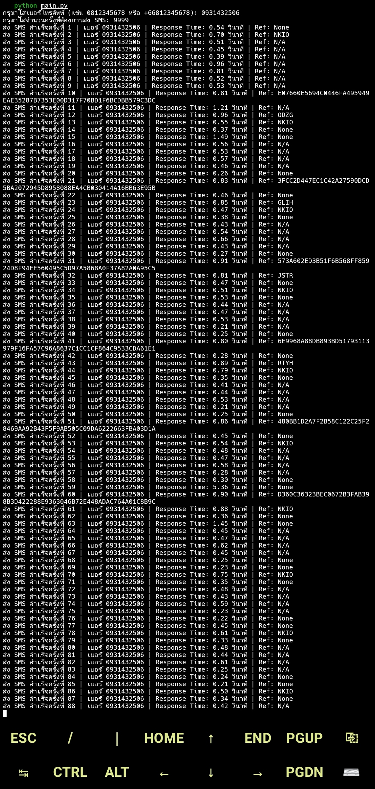

# 📱 Spam Tool (For Educational Purposes Only)

โปรเจกต์นี้เป็นเครื่องมือ **SMS/OTP spamming** สำหรับการทดสอบระบบโทรศัพท์หรือ OTP API โดยใช้ Python.  
⚠️ **ใช้เพื่อการศึกษาหรือทดสอบระบบของตัวเองเท่านั้น ห้ามนำไปใช้ในทางที่ผิดกฎหมาย**

---

## 💡 Features

- ส่ง request แบบสุ่มเบอร์โทร
- รองรับหลาย thread (พร้อมใช้งานกับ queue)
- สร้าง user-agent ปลอมอัตโนมัติ
- ตรวจสอบหมายเลขโทรศัพท์ด้วย `phonenumbers`

---
## 🖼️ ตัวอย่างการใช้งาน




## 🧪 Requirements

- Python 3.8 ขึ้นไป

---

## 🔧 วิธีติดตั้ง

```bash
# 1. Clone โปรเจกต์
git clone https://github.com/Thanwisut/Spam.git
cd Spam

# 2. ติดตั้ง dependencies
pip install -r requirements.txt

# 3. ใช้งาน
python main.py 
